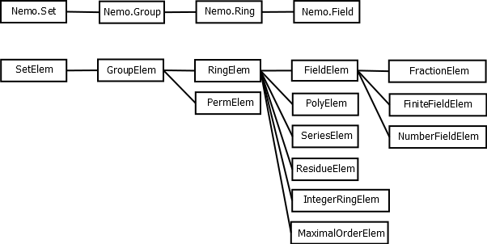

# Types in Nemo

On this page we discuss the type hierarchy in Nemo and a concept known as parents. These details are
quite technical and should be skipped or skimmed by new users of Julia/Nemo. Types are almost never dealt with
directly when scripting Nemo to do mathematical computations. 

In contrast, Nemo developers will certainly want to know how we model mathematical objects and the
rings, fields, groups, etc. that they belong to in Nemo.

## Introduction

Julia provides two levels of types that we make use of

  - abstract types
  - concrete types

Concrete types are just like the usual types everyone is familiar with from C or C++.

Abstract types can be thought of as collections of types. They are used when writing generic functions
that should work for any type in the given collection.

To write a generic function that accepts any type in a given collection of types, we first create an
abstract type. Then we create the individual concrete types that belong to that abstract type. A generic
function can then be constructed with a type parameter, `T` say, similar to a template parameter in C++.
The main difference is that we can specify which abstract type our type parameter `T` must belong to.

We use the symbol `<:` in Julia to determine that a given type belongs to a given abstract type. For
example the built-in Julia type `Int64` for 64 bit machine integers belongs to the Julia abstract type
`Integer`. Thus `Int <: Integer` returns `true`.

Here is some Julia code illustrating this with a more complex example. We create an abstract type called
`Shape` and two user defined concrete types `square` and `circle` belonging to `Shape`. We then show how
to write methods that accept each of the concrete types and then show how to write a generic function
for any type `T` belonging to the abstract type `Shape`.

Note that in the type definitions of `square` and `circle` we specify that those types belong to the
abstract type `Shape` using the `<:` operator.

```
abstract Shape

type square <: Shape
   width::Int
   border_thickness::Int
end

type circle <: Shape
   centre::Tuple{Int, Int}
   radius::Int
   border_thickness::Int
end

function area(s::square)
   return s.width^2
end

function area(s::circle)
   return pi*s.radius^2
end

function border_thickness{T <: Shape}(s::T)
   return s.border_thickness
end

s = square(3, 1)
c = circle((3, 4), 2, 2)

area(s)
area(c)
border_thickness(s)
border_thickness(c)
```

## The abstract type hierarchy in Nemo

Abstract types in Julia can also belong to one another in a hierarchy. For example, the `Nemo.Field`
abstract type belongs to the `Nemo.Ring` abstract type. An object representing a field in Nemo has type
belonging to `Nemo.Field`. But because we define the inclusion `Nemo.Field <: Nemo.Ring` in Nemo, the
type of such an object also automatically belongs to `Nemo.Ring`. This means that any generic function in
Nemo which is designed to work with ring objects will certainly also work with field objects.

In Nemo we also distinguish between the elements of a field, say, and the field itself, and similarly
for groups and rings and all other kinds of domains in Nemo. For example, we have an object of type
`GenPolyRing` to model a generic polynomial ring, and elements of that polynomial ring would have
type `GenPoly`. 

In order to model this distinction between elements and the domains they belong to, Nemo has two main
branches in its abstract type hierarchy, as shown in the following diagram. One branch consists of the
abstract types for the domains available in Nemo and the other branch is for the abstract types for
elements of those domains. 



All objects in Nemo, whether they represent rings, fields, groups, sets, etc. on the one hand, or ring
elements, field elements, etc. on the other hand, have concrete types that belong to one of the abstract
types shown above.

## Why types aren't enough

Naively, one may expect that rings in Nemo can be modeled as types and their elements as objects with the
given type. But there are various reasons why this is not a good model.

As an example, consider the ring $R = \mathbb{Z}/n\mathbb{Z}$ for a multiprecision integer $n$. If we
were to model the ring $R$ as a type, then the type would somehow need to contain the modulus
$n$. This is not possible in Julia, and in fact it is not desirable either.

Julia dispatches on type, and each time we call a generic function with different types, a new version
of the function is compiled at runtime for performance. But this would be a disaster if we were writing
a multimodular algorithm, say. In such an algorithm many rings $\mathbb{Z}/n\mathbb{Z}$ would be needed
and every function we use would be recompiled over and over for each different $n$. This would result 
in a huge delay as the compiler is invoked many times.

For this reason, the modulus $n$ needs to be attached to the *elements* of the ring, not to type
associated with those elements.

But now we have a problem. How do we create new elements of the ring $\mathbb{Z}/n\mathbb{Z}$ given only
the type? Suppose all rings $\mathbb{Z}/n\mathbb{Z}$ were represented by the same type `Zmod` say. How
would we create $a = 3 \pmod{7}$? We could not write `a = Zmod(3)` since the modulus $7$ is not contained
in the type `Zmod`.

We could of course use the notation `a = Zmod(3, 7)`, but this would make implementation of generic
algorithms very difficult, as they would need to distinguish the case where constructors take a single
argument, such as `a = ZZ(7)` and cases where they take a modulus, such as `a = Zmod(3, 7)`.

The way we get around this in Nemo is to have special (singleton) objects that act like types, but are
really just ordinary Julia objects. These objects, called *parent* objects can contain extra information,
such as the modulus $n$. 

In order to create new elements of $\mathbb{Z}/n\mathbb{Z}$ as above, we overload the `call` operator
for the parent object, making it callable. Making a parent object callable is exactly analogous to
writing a constructor for a type.

In the following Nemo example, we create the parent object `R` corresponding to the ring
$\mathbb{Z}/7\mathbb{Z}$. We then create a new element `a` of this ring by calling the parent object
`R`, just as though `R` were a type with a constructor accepting an `Int` parameter. 

```
R = ResidueRing(ZZ, 7)
a = R(3)
```

This example creates the element $a = 3 \pmod{7}$. 

The important point is that unlike a type, a parent object such as `R` can contain additional information
that a type cannot contain, such as the modulus $7$ of the ring in this example, or context objects
required by C libraries in other examples.

## More complex example of parent objects

Here is some Julia/Nemo code which constructs a polynomial ring over the integers, a polynomial in that
ring and then does some introspection to illustrate the various relations between the objects and types.

```
julia> using Nemo

julia> R, x = ZZ["x"]
(Univariate Polynomial Ring in x over Integer Ring,x)

julia> f = x^2 + 3x + 1
x^2+3*x+1

julia> typeof(R)
Nemo.FmpzPolyRing

julia> typeof(f)
Nemo.fmpz_poly

julia> parent(f)
Univariate Polynomial Ring in x over Integer Ring

julia> typeof(R) <: PolyRing
true

julia> typeof(f) <: PolyElem
true

julia> parent(f) == R
true
```

## Concrete types in Nemo

Finally we come to all the concrete types in Nemo. 

These are of two main kinds: those for generic constructions (e.g. generic polynomials over an arbitrary
ring) and those for specific implementations, usually provided by a C library (e.g. polynomials over the
integers, provided by Flint).

Below we give the type of each kind of element available in Nemo. In parentheses we list the types of
their corresponding parent objects. Note that these are the types of the element objects and parent
objects respectively, not the abstract types to which these types belong, which the reader can easily
guess. 

For example, `fmpz` belongs to the abstract type `RingElem` and `FlintIntegerRing` belongs to `Ring`.
Similarly `Poly{T}` belongs to `PolyElem` whereas `PolynomialRing{T}` belongs to `PolyRing`. We also
have that `fmpz_poly` belongs to `PolyElem` and `FmpzPolyRing` belongs to `PolyRing`, and so on.

All the generic types are parameterised by a type `T` which is the type of the *elements* of the ring
they are defined over. 

  - Generic
     - `GenPoly{T}` (`GenPolyRing{T}`)
     - `GenRelSeries{T}` (`GenRelSeriesRing{T}`)
     - `GenRes{T}` (`GenResRing{T}`)
     - `GenFrac{T}` (`GenFracField{T}`)
     - `GenMat{T}` (`GenMatSpace{T}`)

  - Flint
     - `fmpz` (`FlintIntegerRing`)
     - `fmpq` (`FlintRationalField`)
     - `fq_nmod` (`FqNmodFiniteField`)
     - `fq` (`FqFiniteField`)
     - `padic` (`FlintPadicField`)
     - `fmpz_poly` (`FmpzPolyRing`)
     - `fmpq_poly` (`FmpqPolyRing`)
     - `nmod_poly` (`NmodPolyRing`)
     - `fmpz_mod_poly` (`FmpzModPolyRing`)
     - `fq_poly` (`FqPolyRing`)
     - `fq_nmod_poly` (`FqNmodPolyRing`)
     - `fmpz_rel_series` (`FmpzRelSeriesRing`)
     - `fmpq_rel_series` (`FmpqRelSeriesRing`)
     - `fmpz_mod_rel_series` (`FmpzModRelSeriesRing`)
     - `fq_nmod_rel_series` (`FqNmodRelSeriesRing`)
     - `fq_rel_series` (`FqRelSeriesRing`)
     - `fmpz_mat` (`FmpzMatSpace`)
     - `nmod_mat` (`NmodMatSpace`)
     - `perm` (`FlintPermGroup`)

  - Antic
     - `nf_elem` (`AnticNumberField`)

  - Arb
     - `arb` (`ArbField`)
     - `acb` (`AcbField`)
